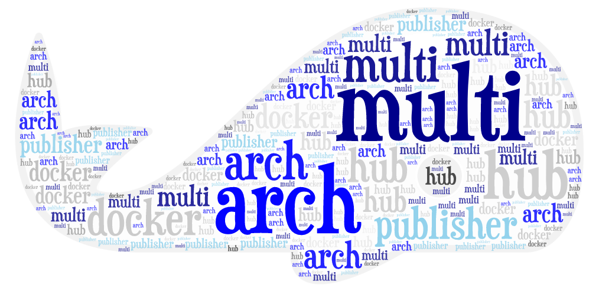

# Seihon

[](https://github.com/ldez/seihon/releases/latest)
[](https://travis-ci.com/ldez/seihon)
[](https://goreportcard.com/report/github.com/ldez/seihon)

A simple tool to publish multi-arch images on the Docker Hub.

If you appreciate this project:

[](https://saythanks.io/to/ldez)



## Installation

### Download / CI Integration

```bash
curl -sfL https://raw.githubusercontent.com/ldez/seihon/master/godownloader.sh | bash -s -- -b $GOPATH/bin v0.4.0
```

<!--
To generate the script:

```bash
godownloader --repo=ldez/seihon -o godownloader.sh

# or

godownloader --repo=ldez/seihon > godownloader.sh
```
-->

### From Binaries

You can use pre-compiled binaries:

* To get the binary just download the latest release for your OS/Arch from [the releases page](https://github.com/ldez/seihon/releases/)
* Unzip the archive.
* Add `seihon` in your `PATH`.


## Usage

- [seihon](docs/seihon.md)
- [seihon publish](docs/seihon_publish.md)
